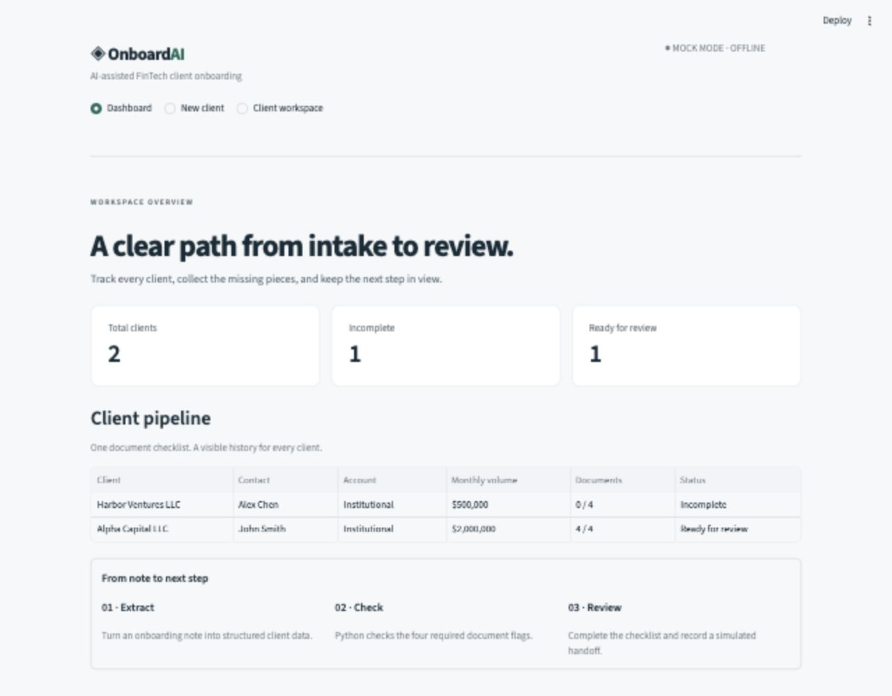
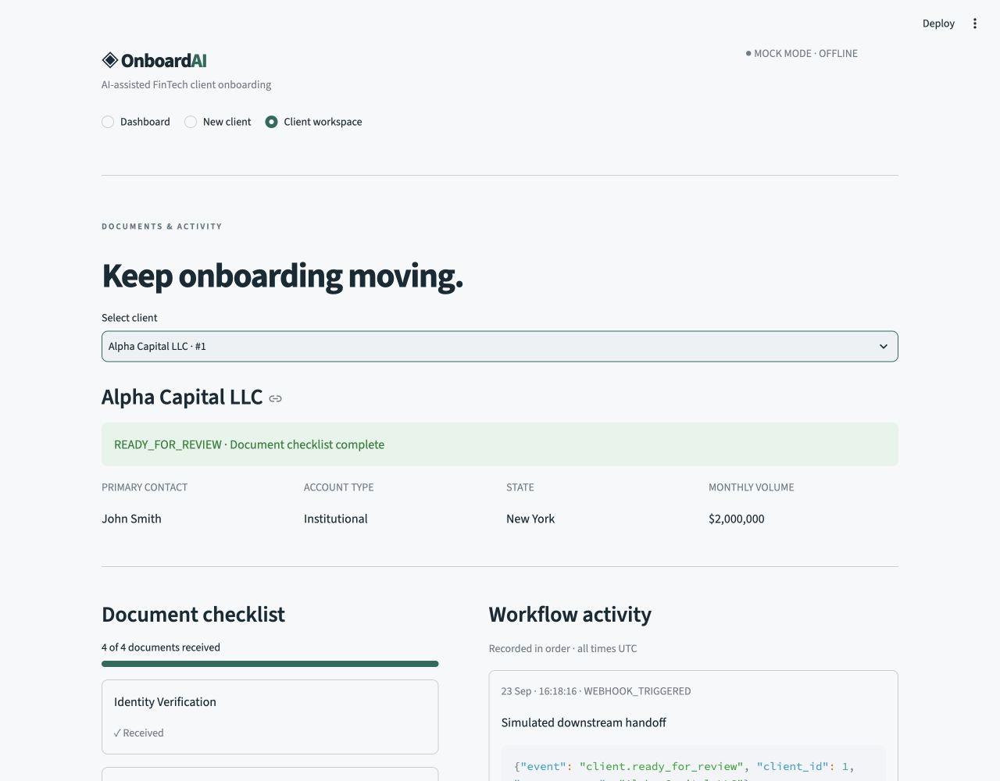

# OnboardAI — AI-Assisted FinTech Client Onboarding

**All clients and data in this project are fictional. This application is a software-engineering demonstration and is not intended to perform real KYC, AML, compliance, or financial decisions.**

OnboardAI turns a fictional onboarding note into validated client data, stores it in SQLite, and tracks a four-document checklist. A Streamlit interface calls a small FastAPI backend. Optional OpenAI extraction handles custom notes; an offline mock mode demonstrates the complete workflow without credentials. Python rules decide when the checklist is ready for human review, and a local event log records the handoff.

Repository description: AI-assisted FinTech client onboarding platform demonstrating LLM extraction, REST APIs, relational data and workflow automation.

## The problem

Onboarding details often begin as unstructured notes. Someone must turn those notes into a client record, identify missing documents, and communicate the next step. This project models that workflow with a small, inspectable Python application. “Received” is only a recorded flag; it does not establish authenticity or regulatory sufficiency.

## Features

- Dashboard with client totals, incomplete and ready counts, and a client table.
- Note intake with typed extraction, an initial summary, and three fictional sample notes.
- Four-document checklist, automatic status recalculation, and timestamped activity history.
- Three related SQLite tables with foreign keys and a unique document type per client.
- Transactional event logging and one simulated webhook per transition to ready.
- Idempotent document receipt: repeating an update does not duplicate events.
- Six REST endpoints, automatic OpenAPI documentation, and 18 pytest tests.

## Architecture

```text
Streamlit (app.py)
        |
        | HTTP / JSON
        v
FastAPI (api.py) ----------> llm_service.py
        |                   mock fixtures OR OpenAI API
        |                   extraction + initial summary
        |                          |
        |                   Pydantic validation
        v                          |
workflow.py <----------------------+
        |
        +--> validation.py: deterministic document rules
        |
        +--> SQLAlchemy --> SQLite
                              |
                              +-- clients
                              +-- documents (many per client)
                              +-- workflow_events (many per client)
                                   includes simulated webhook JSON
```

## Tech stack

Python, FastAPI, Streamlit, SQLite, SQLAlchemy, Pydantic, pytest, and the OpenAI Python SDK. Uvicorn serves FastAPI; HTTPX handles frontend HTTP requests and API tests. There is no separate JavaScript frontend or deployment infrastructure. Direct dependency versions are pinned in `requirements.txt`; transitive dependencies are resolved by pip.

## Local setup

Tested with Python 3.13.2 on macOS. Use Python 3.11 or newer. From the repository directory:

```bash
python3 -m venv .venv
source .venv/bin/activate
python -m pip install -r requirements.txt
```

On Windows, activate with `.venv\Scripts\activate` instead.

Start the API in terminal 1:

```bash
source .venv/bin/activate
python -m uvicorn api:app --reload --host 127.0.0.1 --port 8000
```

Start the interface in terminal 2, from the same directory:

```bash
source .venv/bin/activate
python -m streamlit run app.py --server.address 127.0.0.1 --server.port 8502 --server.headless true
```

Open [OnboardAI](http://127.0.0.1:8502) and the [interactive API docs](http://127.0.0.1:8000/docs). SQLite initializes automatically as `onboard.db` in the API process's working directory. Use the same directory when restarting to retain those clients. The database is excluded from Git. Stop either process with Ctrl+C.

No API key or `.env` file is needed for the default mock mode. `.env.example` documents optional environment variables; the application does **not** automatically load `.env` files. Export settings in the shell that starts the relevant process. `DATABASE_URL` must be a SQLite URL; `API_BASE_URL` configures the frontend if you change the API port.

### Two-minute demo

1. Open **New client**, leave the Alpha Capital note selected, and click **Process Client**.
2. Inspect the extracted fields, received and missing documents, summary, and `INCOMPLETE` status.
3. Open **Client workspace**, choose Alpha Capital, and mark **Tax Form** as received. One document remains missing.
4. Mark **Beneficial Ownership** as received. The status becomes `READY_FOR_REVIEW` and the timeline shows a simulated webhook payload.
5. Open **Dashboard** to see the updated counts. Restart the API to demonstrate that SQLite retains the records.

The Meridian sample starts with a complete checklist; Harbor starts with none received. Submitting the same note again creates another client intentionally—there is no company deduplication.

## How AI is used

`llm_service.py` is the only place with OpenAI calls. In real mode, it uses the Responses API with a Pydantic structured-output schema to extract the client fields and document flags. A second call summarizes the missing-document list already computed by Python. The extraction schema has no `status` field, rejects extra fields, requires actual booleans, and rejects negative or non-finite volume values. Unknown optional client facts are represented as `null`.

The integration follows the [official OpenAI structured-output documentation](https://developers.openai.com/api/docs/guides/structured-outputs). Requests use `store=False`, a 20-second timeout per call, and no automatic retries. Unusable extractions return HTTP 502 and save no client. If only summary generation fails, the app uses a labeled deterministic summary. Summaries are display text and cannot update a workflow status.

Mock mode is a **fixture lookup**, not an AI model or general text parser. It accepts the three supplied notes, ignoring capitalization and whitespace, and returns realistic structured data that passes through the same Pydantic validation and workflow as real extraction. Unsupported custom notes return HTTP 422 rather than silently substituting a fixture. Mock summaries are explicitly labeled as simulated.

To use OpenAI, export these settings in the API terminal before starting the server:

```bash
export MOCK_LLM=false
export OPENAI_MODEL=gpt-4o-mini
read -s 'OPENAI_API_KEY?OpenAI API key: '
export OPENAI_API_KEY
python -m uvicorn api:app --reload --host 127.0.0.1 --port 8000
```

The hidden-input `read` example above is for macOS zsh. Alternatively, set `OPENAI_API_KEY` through your shell's environment management. Use only fictional data. Real mode sends the note to OpenAI and requires a funded account with access to the configured model. Live provider calls were not exercised during the offline build; the adapter's success/refusal behavior was tested with a fake SDK client.

The AI-assisted development process produced implementation, documentation, and tests, followed by local execution and browser verification. This describes the build process, not an additional runtime feature.

## Deterministic checklist

Every account in this MVP is institutional and requires:

| Required item | Completion condition |
| --- | --- |
| Identity Verification | Received flag is true |
| Tax Form | Received flag is true |
| Corporate Registration | Received flag is true |
| Beneficial Ownership | Received flag is true |

All four true means `READY_FOR_REVIEW`; otherwise the status is `INCOMPLETE`. This is checklist completeness only. Missing optional contact/state/volume fields do not alter that rule. An LLM can misinterpret whether a document was received, so human verification of the extracted flags remains necessary.

## API endpoints

| Method | Endpoint | Behavior |
| --- | --- | --- |
| GET | `/health` | Database connectivity and current LLM mode |
| POST | `/clients/from-note` | Validate/extract a note and create a client (201) |
| GET | `/clients` | List clients, newest first |
| GET | `/clients/{client_id}` | Client, documents, and current checklist summary |
| POST | `/clients/{client_id}/documents` | Mark one required document as received |
| GET | `/clients/{client_id}/events` | Activity in insertion order, with UTC timestamps |

Creation body: `{"note": "..."}` (20–10,000 characters after trimming).

Document body: `{"document_type": "Tax Form"}`. Unknown clients return 404, invalid inputs return 422, and unusable model extraction returns 502. GET and document-update responses contain fresh rule-based summaries; the AI-assisted summary is returned at creation only and is not stored as another database field.

## Example

> Alpha Capital LLC is a New York investment firm opening an institutional trading account. John Smith is the primary contact. Expected monthly trading volume is approximately $2 million. Identity verification and corporate registration documents have been received, but the tax form and beneficial ownership information are still missing.

Validated extraction:

```json
{
  "company_name": "Alpha Capital LLC",
  "contact_name": "John Smith",
  "account_type": "Institutional",
  "state": "New York",
  "expected_monthly_volume": 2000000,
  "documents": {
    "Identity Verification": true,
    "Tax Form": false,
    "Corporate Registration": true,
    "Beneficial Ownership": false
  }
}
```

The API also returns a generated ID, UTC creation time, a document-row list, `status: "INCOMPLETE"`, the missing list, a summary, and its source (`mock`, `openai`, or `rules`). Example mock summary: “Collect Tax Form, Beneficial Ownership to complete the document checklist.”

After the remaining documents are recorded, the event log contains a JSON payload like:

```json
{
  "event": "client.ready_for_review",
  "client_id": 1,
  "company_name": "Alpha Capital LLC"
}
```

This is stored locally under `WEBHOOK_TRIGGERED`; nothing is sent to another service. A newly created complete client also transitions from its initial `INCOMPLETE` state to ready and emits one event. Repeated document submissions do not emit another handoff.

## Engineering Decisions

- **Separate extraction from business rules.** Model output is probabilistic; the four-document rule should be predictable, easy to test, and explainable independently of the provider.
- **Validate model output with Pydantic.** Structured JSON is not enough: required fields, allowed types, and value constraints are checked before any database writes.
- **Record workflow events.** The UI can explain which action caused a status change. Data and events commit together; failed transactions roll back. These are demonstration records, not a tamper-proof audit system.
- **Provide mock mode.** Reviewers can run the full application without credentials, network calls, or API charges.
- **Keep SQLite and three tables.** Foreign keys express client ownership; a uniqueness constraint prevents duplicate document types. Document updates use a short SQLite write lock to avoid competing status transitions.

## Testing

```bash
python -m pytest -v
```

The suite contains **18 tests**, using temporary SQLite databases and no API credentials. Tests cover creation and persistence, mock extraction, invalid model data, every missing-document case, status decisions, document updates, event order, webhook payloads, repeated updates, initial readiness, request validation, missing IDs, summary fallback, provider-adapter refusal handling, and rollback on event failure.

The tested environment reports one upstream Starlette warning about HTTPX TestClient deprecation; all tests pass. Provider tests use a fake client and do not measure live-model accuracy. See [BUILD_NOTES](docs/BUILD_NOTES.md) for a beginner-oriented walkthrough.

## Screenshots

Screenshot locations (replace these files after future UI changes):




## Limitations

- A local portfolio MVP with fictional data: no authentication, access control, document uploads, OCR, real KYC/AML services, or regulatory decisions.
- The receipt flags are assertions, not verified documents. AI output can be incorrect even when it satisfies the schema.
- Mock mode supports three fixtures; arbitrary notes require the optional OpenAI API.
- Institutional accounts only, a fixed four-document checklist, and illustrative USD monthly volumes stored as floats—not an accounting ledger.
- No pagination, company deduplication, client editing, or document reversal. Suitable for a small local demo.
- The webhook is an event record only; there is no delivery, receiver, queue, or retry system.
- Initial AI summaries are not persisted; subsequent reads summarize current checklist state deterministically. Raw notes are not stored in SQLite.
- API startup creates tables but does not migrate existing schemas. This project has no cloud infrastructure or production deployment configuration.
